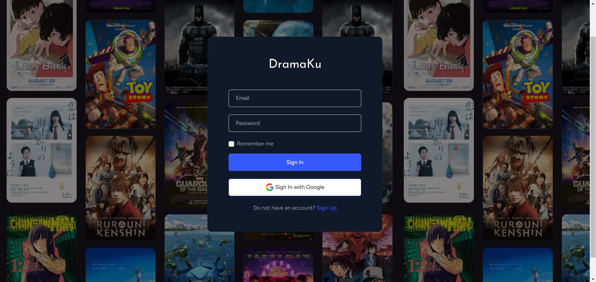

<div align="center">
  
  
  
</div>

**Dramaku** adalah aplikasi website untuk koleksi drama, anime, film, dan serial TV lainnya!

Projek ini merupakan tugas Pengembangan Web Praktek D-4 Teknik Informatika dari kelompok 9 kelas 3B:
- Banteng Harisantoso (221524036)
- Bhisma Chandra Yudha Setiawan (221524037)

---  
<br>  

## 📚 Daftar Isi  

- [📚 Daftar Isi](#-daftar-isi)
- [🎥 Fitur Utama](#-fitur-utama)
- [🖼️ Tampilan Website](#️-tampilan-website)
- [🛠️ Teknologi yang Digunakan](#️-teknologi-yang-digunakan)
- [🚀 Cara Instalasi](#-cara-instalasi)
  - [**Persiapan**](#persiapan)
  - [**Langkah Instalasi Lokal**](#langkah-instalasi-lokal)
  - [**Langkah Instalasi dengan Docker**](#langkah-instalasi-dengan-docker)

---  
<br>  

## 🎥 Fitur Utama  

- 💡 **Cari Film dan Filter**: Temukan judul favorit Anda dengan mudah menggunakan fitur pencarian yang intuitif.  

- ⭐ **Menambah Ulasan**: Bagikan pengalaman Anda dengan menulis ulasan dan memberi rating.  

- 🔒 **Login Google**: Masuk dengan aman melalui akun Google Anda.  

- 🛠️ **Mengelola Konten**: Kelola informasi film, serial, dan ulasan di halaman admin.  

---  
<br>  

## 🖼️ Tampilan Website  

**1. 📌 Halaman Utama**  


**2. 🎞️ Detail Film**  


**3. 🔑 Halaman Login**  


**4. 🖋️ Halaman Admin**  


---  
<br>  

## 🛠️ Teknologi yang Digunakan  

<div style="display: flex; flex-wrap: wrap; justify-content: center; gap: 40px; align-items: center;">
    
    
    
    
    
    
    
</div>

---  
<br>  

## 🚀 Cara Instalasi  

### **Persiapan**  
Berikut merupakan versi yang digunakan:  
- **PHP**: `8.2.12`  
- **Composer**: `2.7.9`  
- **Node.js**: `20.16.0`  
- **npm**: `10.9.0`  

### **Langkah Instalasi Lokal**  

1. **Clone Repository**  

2. **Konfigurasi .env**  
   - Atur detail database dan integrasi Google.

3. **Buat Database Baru**  
   Buat database bernama `dramaku` di PostgreSQL.  

4. **Install Dependencies**  
   ```bash
   composer install
   npm install
   ```

5. **Migrasi Database**  
   ```bash
   php artisan migrate
   ```

6. **Jalankan Aplikasi**  
    ```bash
    npm run dev
    php artisan serve
    ```


### **Langkah Instalasi dengan Docker**  

1. **Ganti Konfigurasi Database**  
   Sesuaikan `.env` dan `docker-compose.yml`.  

2. **Jalankan Docker Desktop**  

3. **Bangun dan Jalankan Container**  
   ```bash
   docker-compose up --build
   ```
